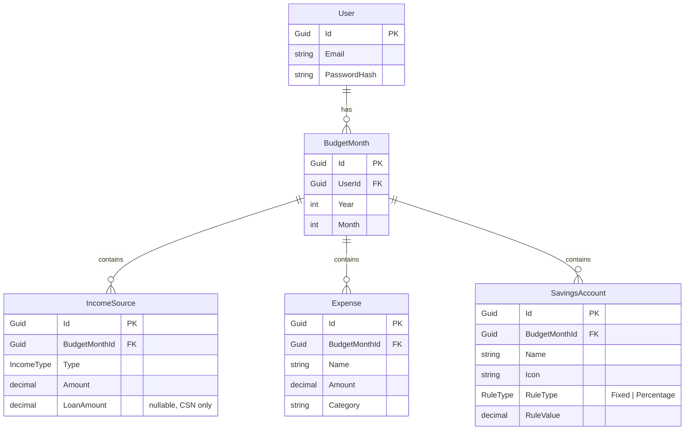

# Budgex — Entity-Relationship Diagram

The domain model for Budgex. A `User` owns many monthly budgets; each
`BudgetMonth` owns its income sources, expenses, and savings accounts.

## Notes

- **`LoanAmount`** is only set when `Type = Csn`. It is the loan portion read
  directly from the user's CSN decision and is never counted as spendable income.
- **`AllocationRule`** (Fixed / Percentage) is a _domain concept_ implemented with
  the strategy pattern, not a table. It is persisted as `RuleType` + `RuleValue`
  on `SavingsAccount` and reconstructed into a rule object in the domain layer.
